# DATA 789 Homework 4
Nitin Shirsat (`nshirsat`)  

## 1. Kubernetes deployment and autoscaling

Verified three ready replicas, running Redis and fraud pods, a LoadBalancer Service, HPA at `2%/40%` with 3-8 pods.

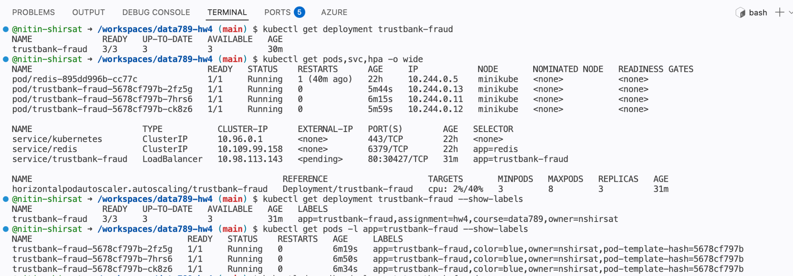

## 2. Deployment configuration

Confirmed `maxUnavailable: 0`, `maxSurge: 1`, CPU/memory limits of `250m/192Mi`, requests of `100m/128Mi`, `/health` probes, and Redis configuration.

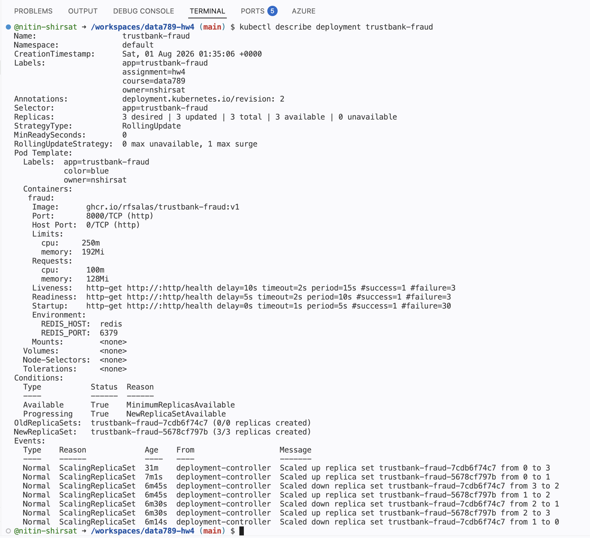

## 3. Local health check 

Confirmed that `http://localhost:8080/health` returned `{"status":"ok"}`.

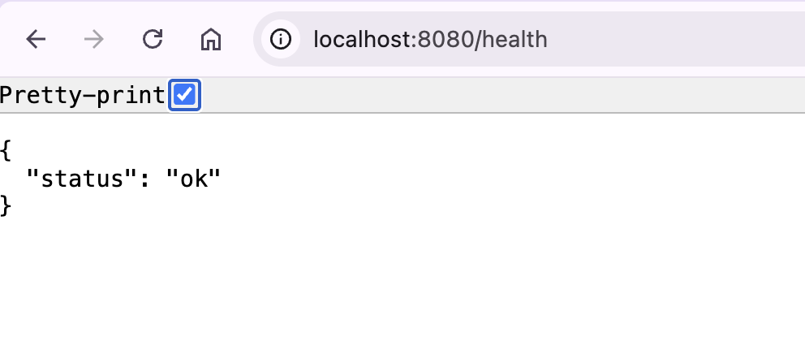

## 4. Kubernetes port forwarding 

Forwarded `localhost:8080` to the `trustbank-fraud` Service and confirmed that Kubernetes handled incoming connections.

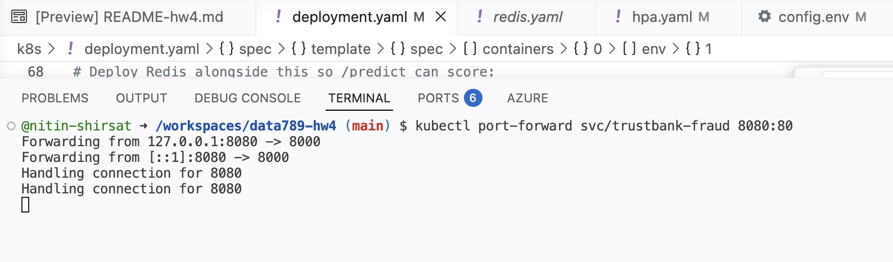

## 5. Local prediction test 

Ran the supplied smoke test and received HTTP `200` with a valid fraud prediction from `/predict`.

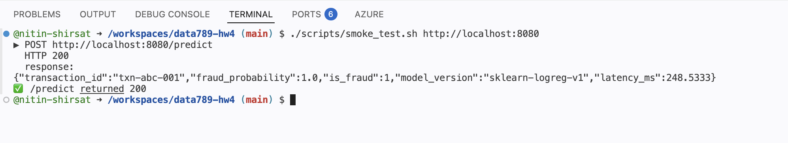

## 6. Supplemental demonstration 

Recorded the Kubernetes demonstration as supplemental evidence: [open recording](screenshots/06-self-healing-recording.mov).

## 7. Intentional pod deletion

Deleted one fraud-service pod to trigger self-healing.

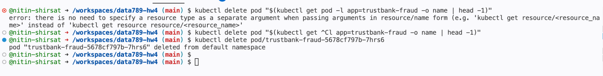

## 8. Self-healing recovery 

Kubernetes replaced the deleted pod through Pending, Creating, and Running states and restored the Deployment to `3/3`.

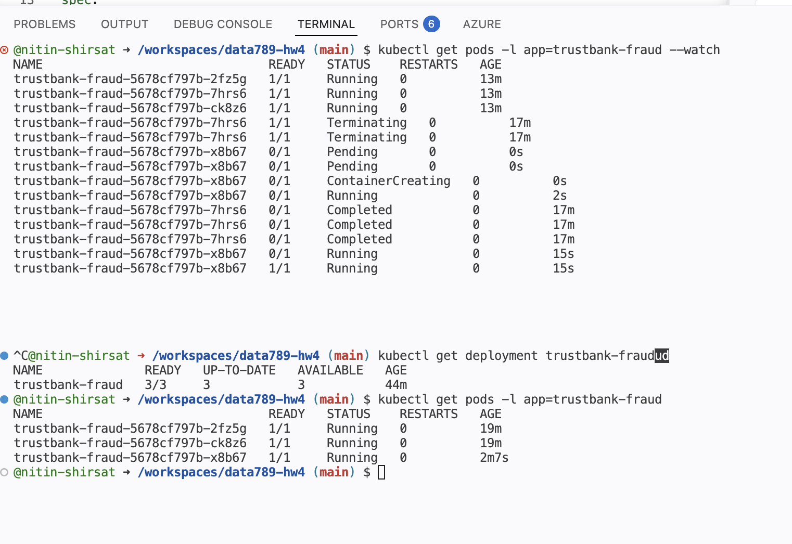

## 9. Zero-downtime rolling update 

Rolled the service to `ghcr.io/rfsalas/trustbank-fraud:v2` while all 25 test requests succeeded with `dropped: 0`.

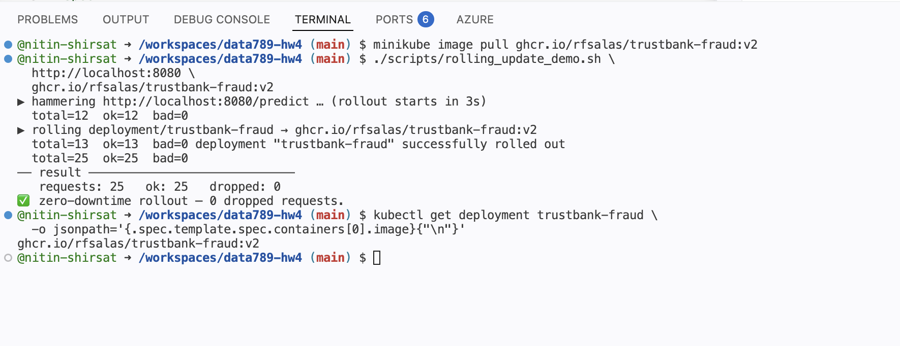

## 10. Continuous rollout traffic 

Repeated Service connections during the rolling-update request loop.

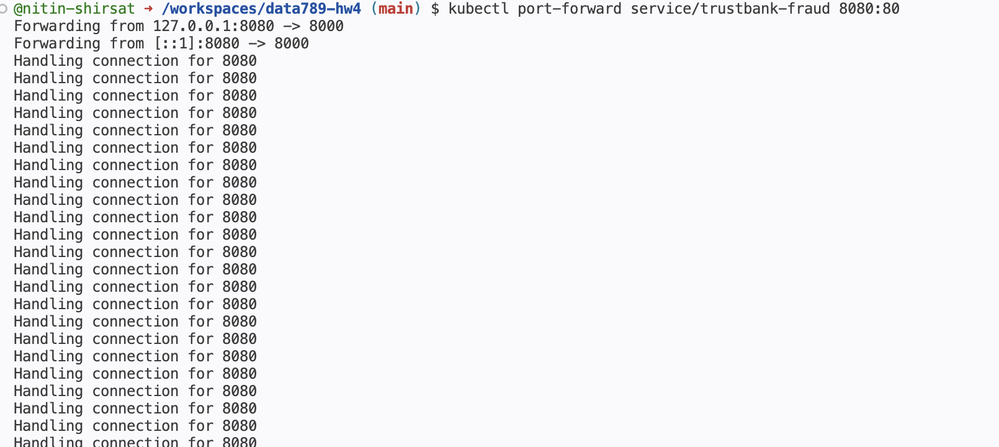

## 11. Blue deployment troubleshooting 

Diagnosed the invalid auto-generated Redis port, set `REDIS_PORT=6379`, and successfully completed the blue Deployment rollout.

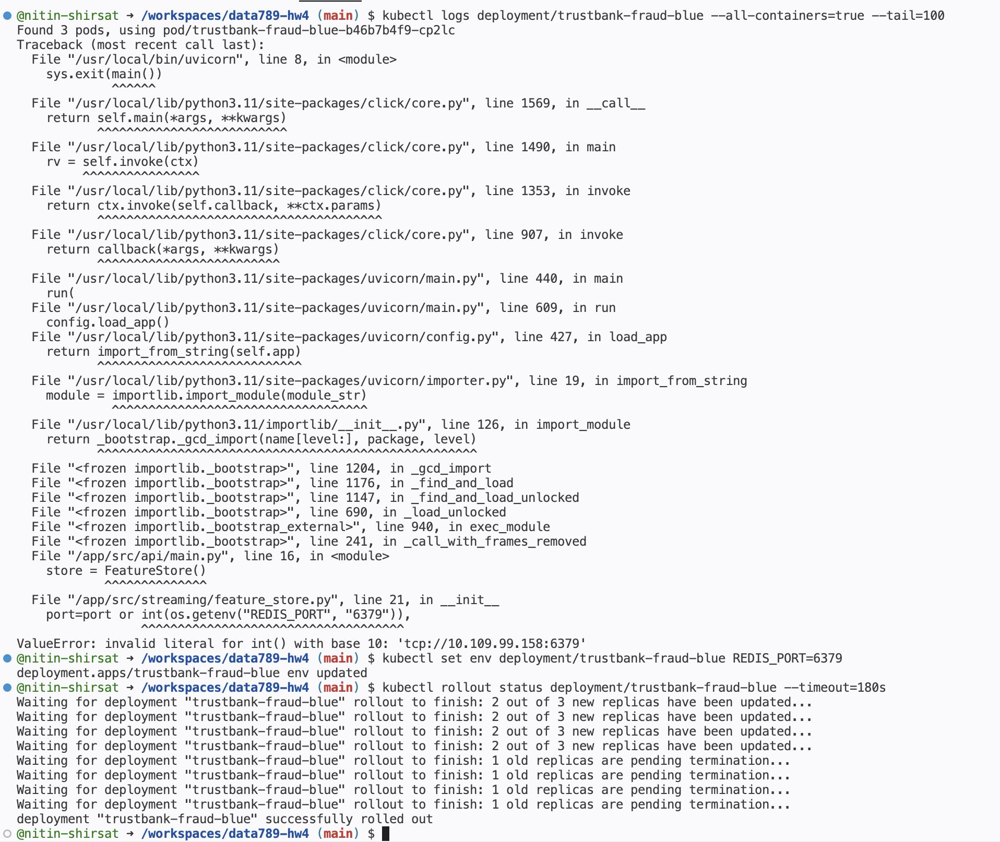

## 12. Green deployment validation 

Applied the Redis correction to green and verified all 3 blue and 3 green pods were `1/1 Running`.

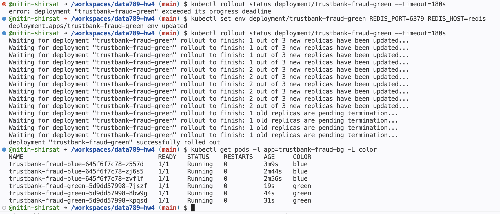

## 13. Pre-cutover green test 

Privately tested green on port `9000` and received successful `/health` and `/predict` responses with HTTP `200`.

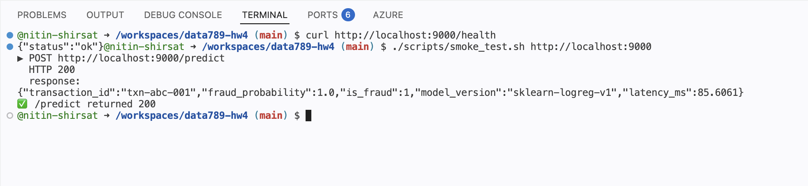

## 14. Blue-green cutover and rollback 

Switched the Service selector from blue to green, verified the green endpoints, and rolled traffic back to blue.

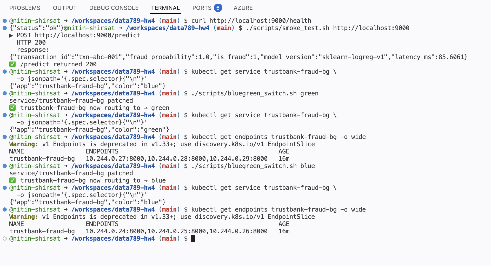

## 15. Azure Container Apps deployment 

After resolving the Azure region/resource-group conflict, deployed the API to EastUS region.

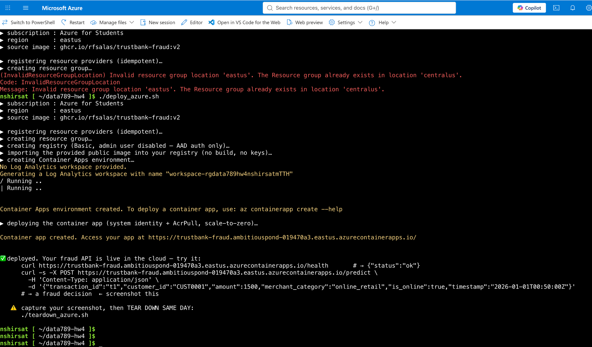

## 16. Azure endpoint verification 

Verified the public Azure `/health` endpoint and received a valid fraud decision from `/predict`.

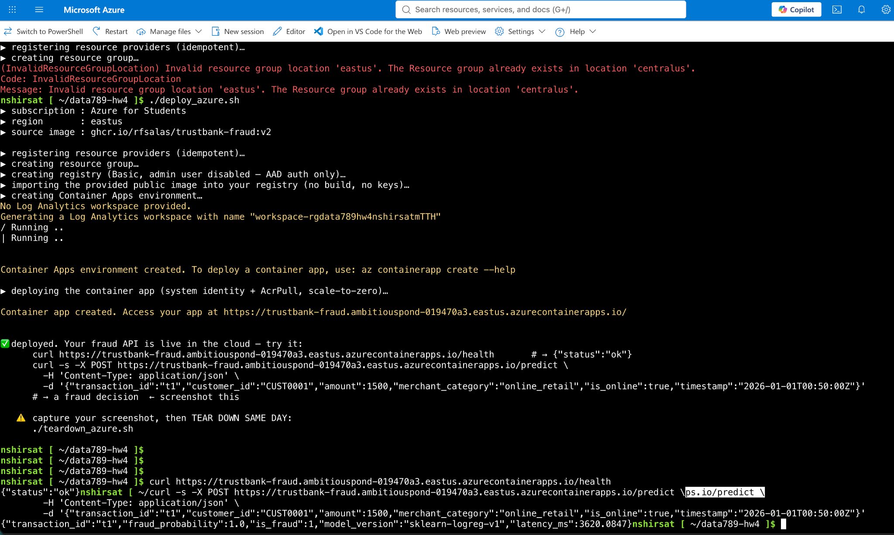

## 17. Azure smoke test 

Ran the given smoke-test script against the Container App and received HTTP `200`.

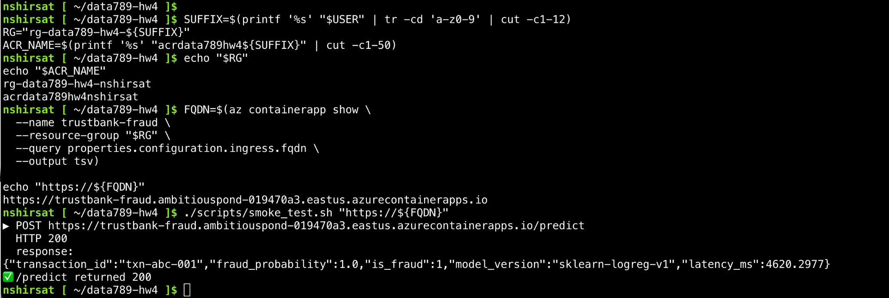

## 18. ACR and Container App verification 

Confirmed the `trustbank-fraud:v1` ACR tag and the running `trustbank-fraud` Container App with its public FQDN.

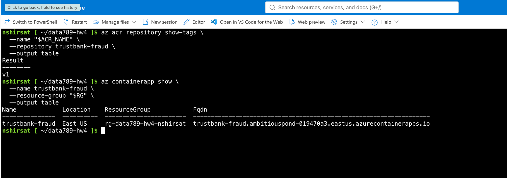

## 19. Azure cleanup activity 

Verified in the Azure activity log that deletion of the generated Log Analytics workspace succeeded.

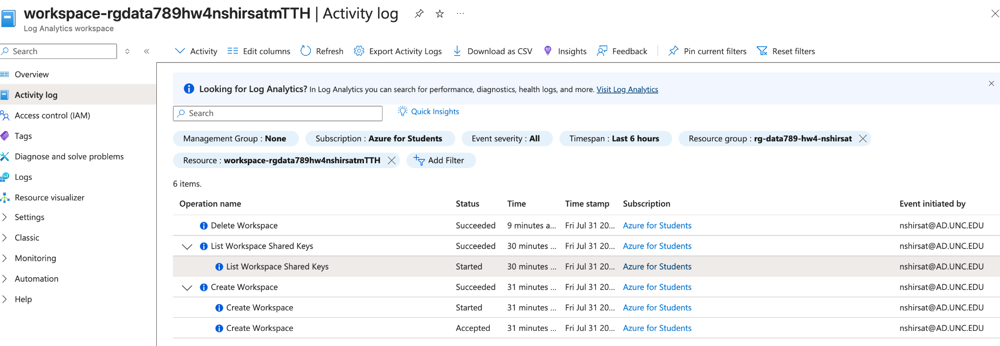

## 20. Azure teardown confirmation 

Ran the teardown script, waited for resource-group deletion, and confirmed `az group exists` finally returned `false`.

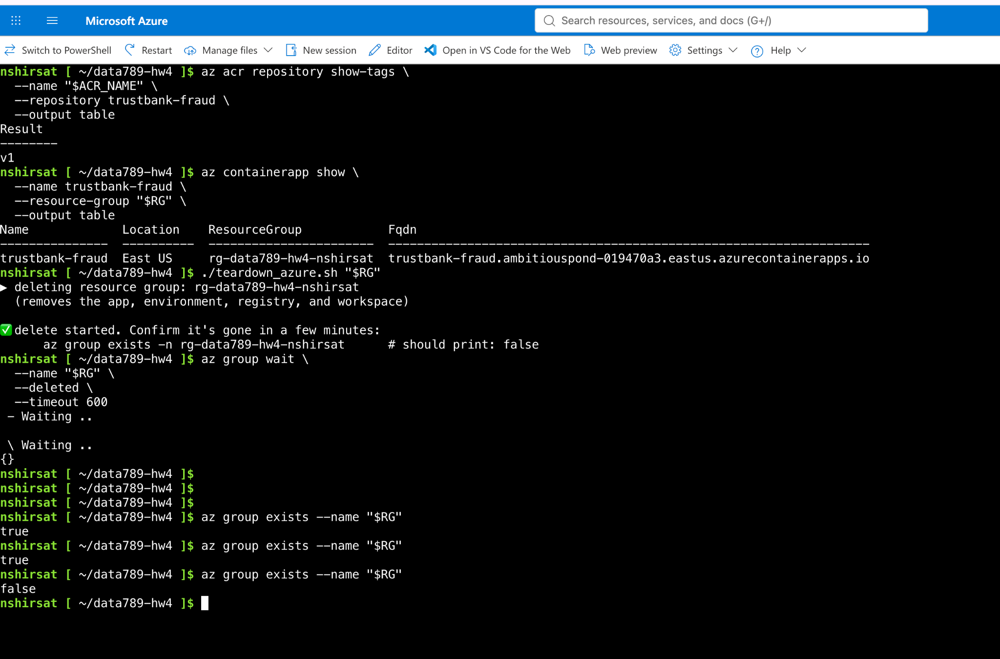
